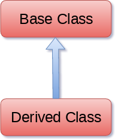
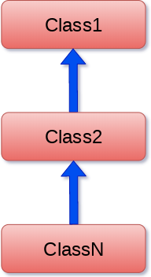
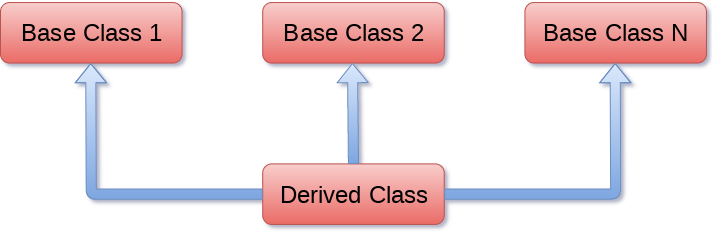
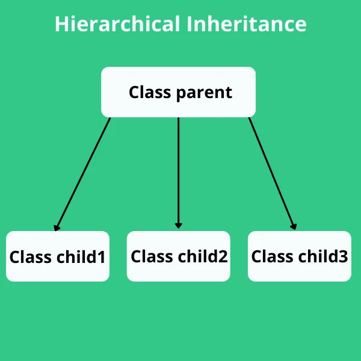

## Object-Oriented Programming (OOPs) 
1. **Class** - A class is a collection of objects. A class contains the blueprints or the prototype from which the objects are being created. It is a logical entity that contains some attributes and methods. 
2. **Objects** - The object is an entity that has a state and behavior associated with it.
3. **Polymorphism** - Polymorphism lets us define methods in the child class that have the same name as the methods in the parent class. In inheritance, the child class inherits the methods from the parent class. However, it is possible to modify a method in a child class that it has inherited from the parent class. This is particularly useful in cases where the method inherited from the parent class doesn’t quite fit the child class. In such cases, we re-implement the method in the child class. This process of re-implementing a method in the child class is known as Method Overriding. 
4. **Encapsulation** - It describes the idea of wrapping data and the methods that work on data within one unit. This puts restrictions on accessing variables and methods directly and can prevent the accidental modification of data. To prevent accidental change, an object’s variable can only be changed by an object’s method. Those types of variables are known as private variables.
A class is an example of encapsulation as it encapsulates all the data that is member functions, variables, etc.
5. **Inheritance** - Inheritance is the capability of one class to derive or inherit the properties from another class.
6. **Data Abstraction** - It hides the unnecessary code details from the user. Also,  when we do not want to give out sensitive parts of our code implementation and this is where data abstraction came.
Data Abstraction in Python can be achieved through creating abstract classes.

### ___init___() Method: 
The __init__() function is called automatically every time the class is being used to create a new object.

### An object consists of :

**State:** It is represented by the attributes of an object. It also reflects the properties of an object.

**Behavior:** It is represented by the methods of an object. It also reflects the response of an object to other objects.

**Identity:** It gives a unique name to an object and enables one object to interact with other objects.

### super() Function :
By using the super() function, you do not have to use the name of the parent element, it will automatically inherit the methods and properties from its parent.

### Types of Inheritance :
1. **Single Inheritance:**
Single-level inheritance enables a derived class to inherit characteristics from a single-parent class.

2. **Multilevel Inheritance:**
Multi-level inheritance enables a derived class to inherit properties from an immediate parent class which in turn inherits properties from his parent class.

3. **Hierarchical Inheritance:**
Hierarchical level inheritance enables more than one derived class to inherit properties from a parent class.

4. **Multiple Inheritance:**
Multiple level inheritance enables one derived class to inherit properties from more than one base class.

### The self Parameter
The self parameter is a reference to the current instance of the class, and is used to
access variables that belongs to the class.

*It does not have to be named self , you can call it whatever you like, but it has to be the
first parameter of any function in the class

### Abstraction in Python
Abstraction is used to hide the internal functionality of the function from the users. The users only interact with the basic implementation of the function, but inner working is hidden. User is familiar with that "what function does" but they don't know "how it does."

### Abstraction classes in Python
In Python, abstraction can be achieved by using abstract classes and interfaces.

A class that consists of one or more abstract method is called the abstract class. Abstract methods do not contain their implementation. Abstract class can be inherited by the subclass and abstract method gets its definition in the subclass. Abstraction classes are meant to be the blueprint of the other class. An abstract class can be useful when we are designing large functions. An abstract class is also helpful to provide the standard interface for different implementations of components. Python provides the abc module to use the abstraction in the Python program.

### Working of the Abstract Classes
Unlike the other high-level language, Python doesn't provide the abstract class itself. We need to import the abc module, which provides the base for defining Abstract Base classes (ABC). The ABC works by decorating methods of the base class as abstract. It registers concrete classes as the implementation of the abstract base. We use the @abstractmethod decorator to define an abstract method or if we don't provide the definition to the method, it automatically becomes the abstract method. 

### Encapsulation for Variable and method
1. Protected members: Protected members (in C++ and JAVA) are those members of the class that cannot be accessed outside the class but can be accessed from within the class and its subclasses. To accomplish this in Python, just follow the convention by prefixing the name of the member by a **single underscore “_”**.
2. Private members:  Private members are similar to protected members, the difference is that the class members declared private should neither be accessed outside the class nor by any base class. In Python, there is no existence of Private instance variables that cannot be accessed except inside a class.

However, to define a private member prefix the member name with **double underscore “__”**.

### Python Inheritance 
**Single Inheritance:**

**Python Multi-Level inheritance**

**Python Multiple inheritance**

**Hierarchical Inheritance:**

### The issubclass(sub,sup) method
The issubclass(sub, sup) method is used to check the relationships between the specified classes. It returns true if the first class is the subclass of the second class, and false otherwise.

### isinstance (obj, class) method
The isinstance() method is used to check the relationship between the objects and classes. It returns true if the first parameter, i.e., obj is the instance of the second parameter, i.e., class.

### Method Overriding
We can provide some specific implementation of the parent class method in our child class. When the parent class method is defined in the child class with some specific implementation, then the concept is called method overriding. We may need to perform method overriding in the scenario where the different definition of a parent class method is needed in the child class.

### Method Overloading
 python does not support method overloading by default. But there are different ways to achieve method overloading in Python.
The problem with method overloading in Python is that we may overload the methods but can only use the latest defined method.

